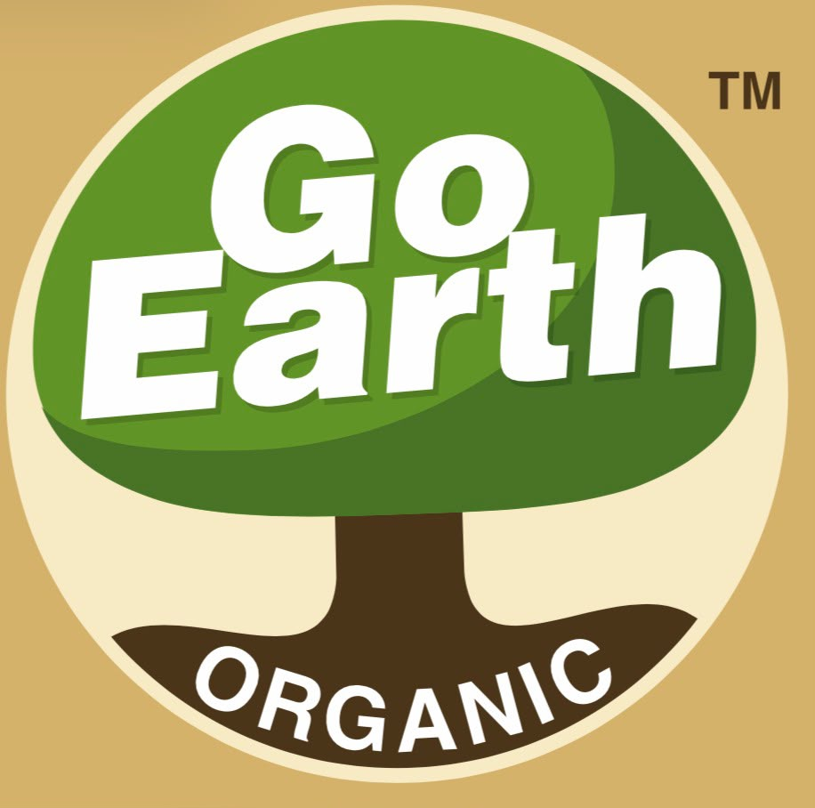

# 🌿 GE-Bot-1 | Go Earth Organic Smart Farm Robotic Platform



> **Autonomous Multilingual Agro-Robotic Ecosystem with Precision Laser Neutralization, Soil Heatmap Zoning & P25 Organic Composite Calculator**

---

## 🌾 Overview

**GE-Bot-1** is a next-generation autonomous agricultural robotic ecosystem developed in collaboration with **Go Earth Organic**. Engineered to tackle **Hackathon Problem Statement P25 (Uncertainty in Organic Fertilizer and Compost Requirements)**, GE-Bot-1 combines penetrative soil NPK telemetry, autonomous zero-chemical laser weed and pest defense, real-time satellite field zoning, automated perimeter intruder deterrence, and live camera feed with an optical HUD.

---

## 🚀 Key Capabilities & Modules

### 1. 🧮 Go Earth Organic Fertilizer & Compost Calculator (P25)
- Automated acreage-scaled prescriptions for 100% certified organic inputs:
  - **Bio-Compost Gold** (Soil conditioner & microbial bio-inoculant)
  - **Vermicompost Plus** (High-humus earthworm castings)
  - **Neem Khali / Neem Cake** (Nitrification inhibitor & pest deterrent)
  - **PROM** (Phosphate Rich Organic Manure - Rock Phosphate + Organic Carbon)
  - **Liquid Jeevamrut** (Microbial consortium spray)
- 3-Stage Application Schedule (Basal Pre-Sowing, 30-Day Vegetative, 60-Day Grain Filling).

### 2. 🎯 Autonomous Laser Weed & Pest Neutralization
- Zero-chemical, targeted optical ablation.
- Real-time eliminated kill logs and counter analytics for weeds (*Parthenium, Nut Grass, Jungle Rice*) and destructive pests (*Cotton Bollworm, Caterpillar, Aphids*).
- 2x2 grid analytics tracking total targets eliminated, weeds neutralized, pests ablated, and chemical usage reduction (100% zero synthetic pesticides).

### 3. 🗺️ Real Farm Satellite Aerial Map & Soil Health Zoning
- Interactive farm aerial zoning with clear visual color codes:
  - 🔴 **Danger Zone (Sector A)**: Severe Nitrogen deficit (<150 kg/ha)
  - 🟠 **Moderate Zone (Sectors B & D)**: Low Phosphorus / Potash deficit
  - 🟢 **Safe Zone (Sectors C, E & F)**: Optimal organic biomass balance
- Live GE-Bot-1 patrol marker with GPS coordinates.

### 4. 📹 Real Laptop Webcam Streaming with Optical HUD
- Real-time browser webcam streaming via `navigator.mediaDevices.getUserMedia`.
- Military/agricultural optical HUD overlay with live target reticles, bio-spectral indicators, and snapshot capture capability.

### 5. 🛡️ Perimeter Intrusion Defense & Wildlife Deterrence
- AI thermal and night-vision snapshot analysis with bounding boxes for wild boars, stray cattle, and rodents.
- Multi-tier non-lethal deterrent countermeasures:
  - **110dB Acoustic Siren & Strobe Beacons**
  - **24 kHz Ultrasonic Pulse Generator**
  - **Autonomous GE-Bot-1 Intercept Dispatch**

### 6. 🌦️ Weather & Smart Irrigation
- 5-day agro-meteorological forecast with precipitation probability and wind vectors.
- One-touch Smart Drip Valve switch with automatic rain delay protection.

---

## 🛠️ Tech Stack

- **Frontend**: Responsive HTML5, Vanilla CSS3 (Custom Glassmorphic Design System, 2x2 Responsive Card Architecture, CSS Variables), Modern Vanilla JavaScript (ES6+), FontAwesome 6 Icons, Outfit & Plus Jakarta Sans Google Typography.
- **Backend**: Node.js, Express.js, Socket.io (Low-Latency Telemetry & Hardware Control), RESTful Architecture.
- **Database**: 
  - Local Dev: SQLite (`better-sqlite3`) with WAL journal mode.
  - Production Cloud: Supabase (PostgreSQL with relational foreign keys and schema migration).
- **Robotics & IoT**: ESP32-S3 Dual-Core SoC, APM 2.8 MavLink Flight Controller, HC-SR04 Ultrasonic Radar, L298N Motor Drivers.
- **AI Engine**: Google Gemini API & Web Speech API for multilingual voice commands (English, Hindi, Marathi, Gujarati, Punjabi, Tamil, Telugu, Bengali).

---

## ⚡ Quick Start (Local Setup)

1. **Clone the repository**:
   ```bash
   git clone https://github.com/harshpdcode/GO-Earth-Bot-1.git
   cd GO-Earth-Bot-1
   ```

2. **Install dependencies**:
   ```bash
   npm install
   ```

3. **Configure Environment Variables**:
   Create a `.env` file in the root folder:
   ```env
   PORT=5000
   SESSION_SECRET=go-earth-bot-super-secure-key-2026
   GEMINI_API_KEY=your_gemini_api_key_here
   ```

4. **Start the Application**:
   ```bash
   npm start
   ```
   Open your browser at `http://localhost:5000`.

---

## 🌐 Cloud Deployment Guide

### Step 1: Database Setup on Supabase
1. Create a free project on [Supabase](https://supabase.com/).
2. Go to **SQL Editor** in your Supabase project dashboard.
3. Open [`database/supabase_schema.sql`](database/supabase_schema.sql) from this repository, paste the entire SQL code, and click **RUN**.
4. Go to **Project Settings > Database** and copy your PostgreSQL connection URI.

### Step 2: Backend Setup on Render
1. Create a free account on [Render](https://render.com/).
2. Click **New + > Web Service** and connect your GitHub repository `GO-Earth-Bot-1`.
3. Configure the service:
   - **Name**: `ge-bot-1-backend`
   - **Environment**: `Node`
   - **Build Command**: `npm install`
   - **Start Command**: `node backend/server.js`
4. Under **Environment Variables**, add:
   - `PORT`: `5000`
   - `SESSION_SECRET`: *(auto-generated or custom random string)*
   - `GEMINI_API_KEY`: *(your Gemini key if using AI chatbot)*
5. Click **Deploy Web Service** and copy your backend URL (e.g., `https://ge-bot-1-backend.onrender.com`).

### Step 3: Frontend Setup on Vercel
1. Create a free account on [Vercel](https://vercel.com/).
2. Click **Add New > Project** and import `GO-Earth-Bot-1`.
3. Leave **Framework Preset** as *Other* (or configure Root Directory as `./`).
4. Click **Deploy**. Vercel will automatically read [`vercel.json`](vercel.json) to serve the UI with clean URLs and routes.

---

## 👥 Demo Credentials
- **Admin**: `admin` / `admin123`
- **Field Operator**: `user` / `user123`

---

## 📜 License
Distributed under the MIT License. Developed for Go Earth Organic Smart Farm Robotics.
